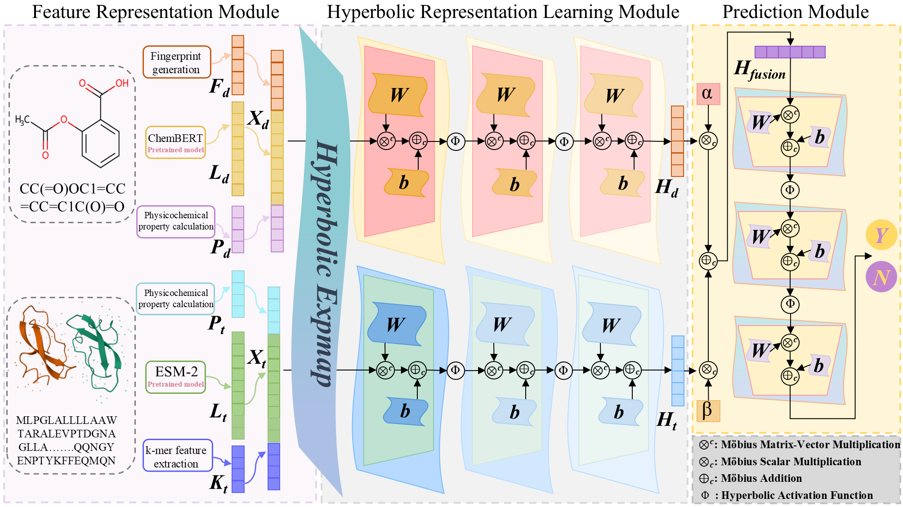

# HyperDTI-Lite

**HyperDTI-Lite**:The model consists of three components: the feature representation module, the hyperbolic representation learning module, and the prediction module. First, the feature representation module extracts homologous heterogeneous features separately from drug SMILES strings and target sequences in Euclidean space. After concatenating these features, they are mapped into hyperbolic space. The hyperbolic representation learning module then performs representation learning on above hyperbolic features. Finally, the prediction module outputs drug–target interaction predictions based on the fused features.

## HyperDTI-Lite

## Data
### Data download
- get from the ./Dataset folder
   - Due to file size limitations, only DrugBank and Davis are provided.
- get from Link: https://pan.baidu.com/s/1vGt320EY2EnnnIdD6qb4cA?pwd=85ej
   - Extraction code: 85ej
   - DrugBank, Davis, and KIBA are all available for download.

## Resources:
+ Key Source Files
  + HyperbolicTriplet.py：Main File.
  + hyperparameter.py：Hyperparameter configuration file.
  + model.py：Model definition file.
  + pytorchtools.py：Early stopping and loss function definition.
  + dataset.py: Definition of the Dataset and Dataloader.
  + utils.py: Associated Functions.
+ Supporting Source Files
  + creat_drug_prefile.py：Pre-generate drug feature .json files for subsequent reading.
  + creat_target_prefile.py：Pre-generate target feature .json files for subsequent reading.
  + calculate_parameters.py：Count the learnable parameters of the model.
  + operate_drug.py：Preprocessing of Drug Inputs.
  + operate_target.py：Preprocessing of Target Inputs.
  + EuclideanDTI.py：Main Script for Manifold Ablation Experiment.
  + model_euc.py: The Euclidean variant of the model for manifold ablation studies.
  + hyperbolic_linear.py：Self-implemented hyperbolic linear layer.
  + Visualization.py: Visualization Script

## Setup and dependencies 
Dependencies:
- python 3.9.16
- pytorch >=1.12
- pyg	2.2.0
- rdkit	2022.9.5
- numpy
- sklearn
- tqdm
- tensorboardX
- prefetch_generator
- matplotlib

# Run:

python HyperbolicTriplet.py
